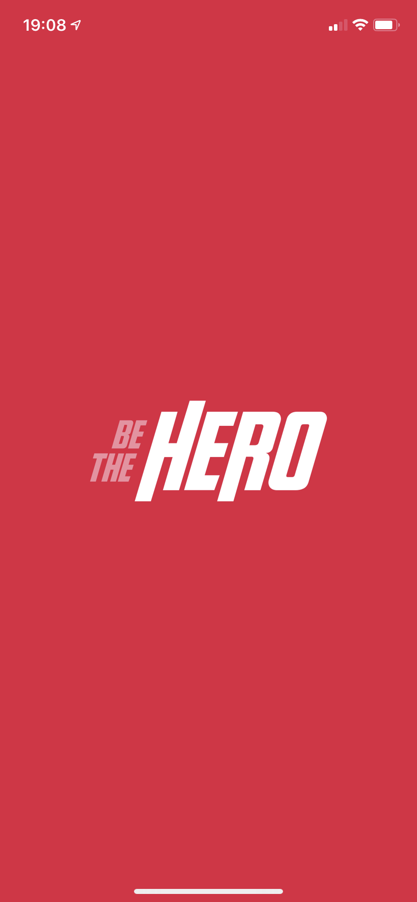

<h1 align="center">
    
</h1>

<h4 align="center">
  Encontre um herói ou seja o herói!
</h4>

  <a href="#rocket-tecnologias">Tecnologias</a>&nbsp;&nbsp;&nbsp;|&nbsp;&nbsp;&nbsp;
  <a href="#-projeto">Projeto</a>&nbsp;&nbsp;&nbsp;|&nbsp;&nbsp;&nbsp;
  <a href="#screenshots-web">Web</a>&nbsp;&nbsp;&nbsp;|&nbsp;&nbsp;&nbsp;
  <a href="#screenshots-mobile">Mobile</a>

## :rocket: Tecnologias

Esse projeto foi desenvolvido com as seguintes tecnologias:

- [Node.js](https://nodejs.org/en/)
- [React](https://reactjs.org)
- [React Native](https://facebook.github.io/react-native/)
- [Expo](https://expo.io/)

## 💻 Projeto

O **Be The Hero** é um projeto desenvolvido com a finalidade de ajudar ONGs a encontrarem os seus heróis.

Na aplicação web qualquer ONG pode se cadastrar e publicar os casos que estão precisando de ajuda.

No mobile os heróis conseguem visualizar todos os casos publicados pelas ongs e entrar em contato com elas.

## Screenshots Web

- Logon:

  

- Cadastro:

  

  

- Perfil da ONG:

  

- Cadastro de novo caso:

  

  

## Screenshots Mobile

- Splash Screen:

  

- Listagem de todos os casos:

  

- Detalhes de um caso:

  

